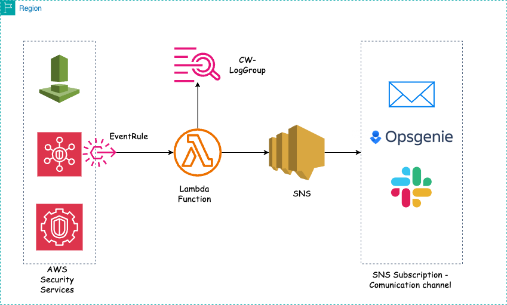

# Monitoring AWS Security Services.

## How it Works.
1. EventRule that gets trigger as soon as if any one of the Security services get deactivated/disabled/deleted.

2. Event rule target is Lambda function, that extract details from corresponding event. Details like, username - who disabled service, source ip, timestamp, eventname, eventsource. This will help us in investigation.

3. Once event is processed by Lambda, lambda publish message to SNS.

4. With SNS, depending on subscription (Email, SMS, HTTPs) we will get notified. Here we can cofigure any communication channel thats feasible for us. For this blog and demo, I'm using only Email and OpsGenie.

If you would like to extend this monitoring for other services, you can refer below table.

| Security Service        | Description                                                                                                        | CloudTrail Event Source       | Event Name (when disabled) |
|-------------------------|--------------------------------------------------------------------------------------------------------------------|-------------------------------|----------------------------|
| AWS CloudTrail          | Tracks API calls and user activity within your AWS account.                                                        | cloudtrail.amazonaws.com      | StopLogging                |
| Amazon GuardDuty        | Threat detection service that continuously monitors for malicious activity.                                        | guardduty.amazonaws.com       | StopMonitoringMembers      |
| Amazon GuardDuty        | Threat detection service that continuously monitors for malicious activity.                                        | guardduty.amazonaws.com       | DeleteDetector             |
| AWS Config              | Monitors and records configurations of AWS resources and evaluates resource compliance.                            | config.amazonaws.com          | StopConfigurationRecorder  |
| AWS Security Hub        | Provides a comprehensive view of security alerts and security posture across AWS accounts.                         | securityhub.amazonaws.com     | DisableSecurityHub         |
| AWS Shield              | Managed DDoS protection service that safeguards applications.                                                      | shield.amazonaws.com          | DeleteSubscription         |
| Amazon Macie            | Uses machine learning to discover, classify, and protect sensitive data.                                           | macie2.amazonaws.com          | DisableMacie               |
| AWS Firewall Manager    | Centrally configures and manages firewall rules across accounts and applications.                                  | fms.amazonaws.com             | DeletePolicy               |
| AWS IAM Access Analyzer | Helps identify resources that are shared with external entities.                                                   | access-analyzer.amazonaws.com | DeleteAnalyzer             |
| Amazon Inspector        | Automated security assessment service to help improve the security and compliance of applications deployed on AWS. | inspector.amazonaws.com       | DeleteAssessmentTarget     |
| AWS WAF                 | Web application firewall that helps protect web applications from common web exploits.                             | waf.amazonaws.com             | DeleteWebACL               |

